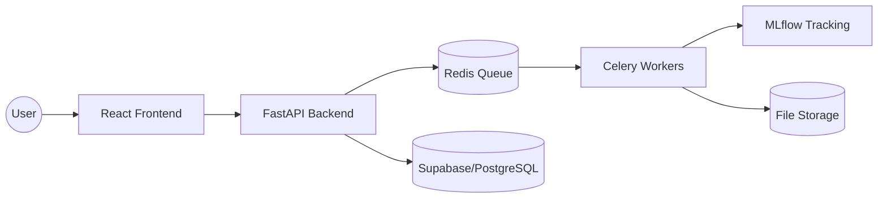
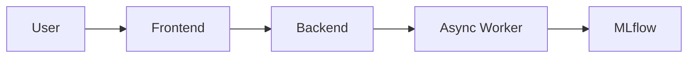
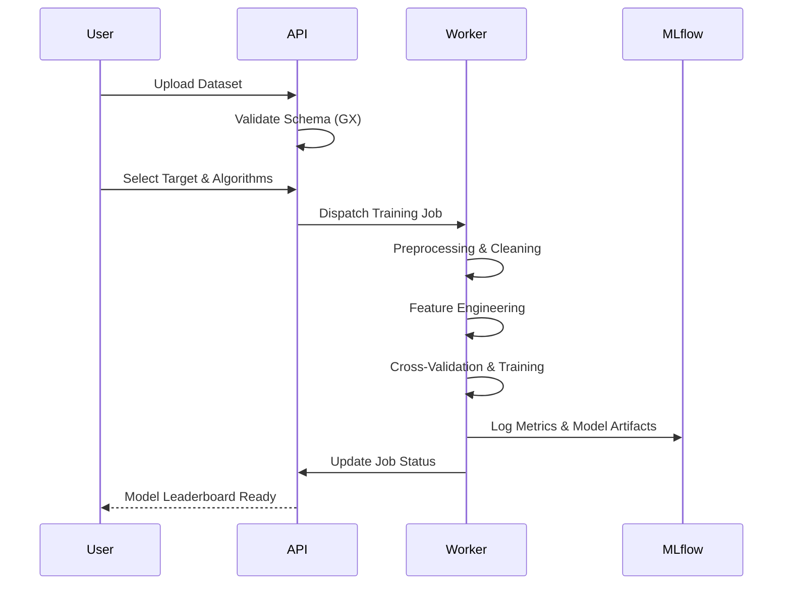
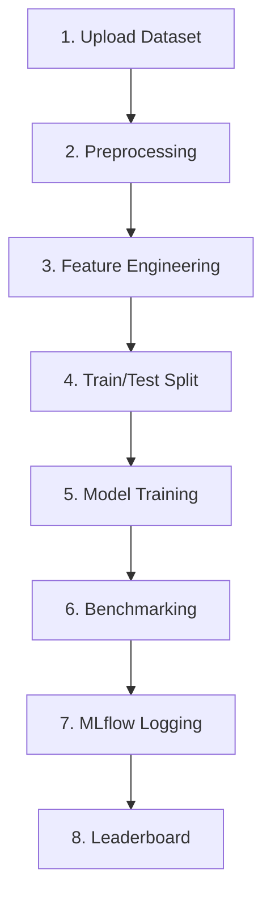

# Prism AI

[](https://www.python.org/downloads/)
[](https://fastapi.tiangolo.com/)
[](https://reactjs.org/)
[](https://tailwindcss.com/)
[](https://www.docker.com/)
[](https://mlflow.org/)

**End-to-End Automated Data Cleaning & AutoML Platform with MLOps**

Prism AI is a high-performance AutoML platform designed to automate the painful parts of data science. From intelligent, context-aware data cleaning to multi-model benchmarking and experiment tracking, it provides a unified environment for building production-grade machine learning pipelines.

---

## 🚀 Features

- **Intelligent Data Cleaning**: Automated handling of missing values, encoding, and scaling using rule-based and AI-powered logic.
- **Feature Engineering**: Automated selection and suggestion of target columns and feature transformations.
- **Outlier Handling**: Robust detection and treatment of statistical anomalies.
- **AutoML Benchmarking**: Simultaneous training and comparison of multiple algorithms (XGBoost, Random Forest, SVM, etc.).
- **MLflow Tracking**: Complete experiment logging, parameter tracking, and model versioning.
- **Dynamic Leaderboard**: Real-time ranking of models based on accuracy, R2, and training efficiency.
- **Async Job Processing**: Non-blocking background training powered by Celery and Redis.
- **Premium Modern UI**: A sleek, white and purple glassmorphism interface built with React and Framer Motion.

---

## 🏗️ Architecture

Prism AI uses a distributed architecture to ensure scalability and isolation between the API layer and heavy ML computations.

### 🏛️ High-Level Topology
```text
┌─────────────────────────────────────────────────────────┐
│                    Prism AI Architecture           │
└────────┬────────────────────────────────────────┬───────┘
         │                                        │
   ┌─────▼─────┐                          ┌───────▼───────┐
   │ React     │                          │ Supabase DB   │
   │ Frontend  │                          │ (PostgreSQL)  │
   └─────┬─────┘                          └───────┬───────┘
         │                                        │
   ┌─────▼──────────────┐                         │
   │ FastAPI Backend    │◄────────────────────────┘
   │ (Job Orchestrator) │
   └─────┬──────────────┘
         │
   ┌─────▼──────────────┐          ┌───────────────────────┐
   │ Redis Message      │─────────▶│ Celery Background     │
   │ Broker             │          │ Worker (ML Pipeline)  │
   └────────────────────┘          └──────────┬────────────┘
                                              │
               ┌──────────────────────────────┼──────────────────────────────────┐
               │                              │                                  │
         ┌─────▼─────┐                  ┌─────▼─────────┐                  ┌─────▼─────┐
         │ Storage   │                  │ MLflow Server │                  │ Dataset   │
         │ (Models)  │                  │ (Tracking)    │                  │ Versioning│
         └───────────┘                  └───────────────┘                  └───────────┘
```



### 🧱 System Interaction


- **Frontend**: Single Page Application (SPA) for real-time monitoring and control.
- **Backend**: High-performance FastAPI gateway handling request validation and job orchestration.
- **Task Queue**: Redis acts as the message broker for asynchronous ML tasks.
- **Workers**: Dedicated Celery workers execute the ML pipeline (Cleaning -> Training -> Evaluation).

---

## ⚙️ Tech Stack

### Frontend
- **Framework**: React 18, Vite
- **Styling**: Tailwind CSS, Framer Motion (Animations)
- **State Management**: React Context, React Query

### Backend
- **Framework**: FastAPI (Python 3.9+)
- **API Architecture**: RESTful with Pydantic validation
- **Database**: SQLAlchemy, Supabase (Cloud PostgreSQL)

### Machine Learning
- **Core**: scikit-learn, pandas, NumPy
- **Algorithms**: XGBoost, LightGBM, Random Forest, SVM
- **Validation**: Great Expectations (GX)

### Infrastructure
- **Orchestration**: Docker, Docker Compose
- **Async Processing**: Celery, Redis
- **MLOps**: MLflow (Experiment & Artifact Tracking)

---

## 🧪 How to Run

### 1. Clone the Repository
```bash
git clone https://github.com/karthikeyan11-dev/Prism-AI.git
cd Prism-AI
```

### 2. Configure Environment
Copy the example environment file and fill in your credentials (API keys, Database URLs):
```bash
cp .env.example .env
```

### 3. Launch with Docker
Prism AI is fully containerized. Start all services (Frontend, Backend, Workers, Redis, MLflow) with one command:
```bash
docker-compose up --build
```

### 4. Access the Services
- **Frontend**: [http://localhost:5173](http://localhost:5173)
- **Backend API Docs**: [http://localhost:8000/docs](http://localhost:8000/docs)
- **MLflow Dashboard**: [http://localhost:5000](http://localhost:5000)

---

## 📊 System Flow

The Prism AI pipeline follows a strict MLOps-compliant workflow:

### 🔄 End-to-End Pipeline
```text
  1. DATA INGESTION       2. PREPROCESSING        3. FEATURE ENG.
  ┌───────────────┐       ┌───────────────┐       ┌───────────────┐
  │ Upload CSV/   │──────▶│ AI-Powered    │──────▶│ Target &      │───┐
  │ Excel Dataset │       │ Cleaning      │       │ Feature Sug.  │   │
  └───────────────┘       └───────────────┘       └───────────────┘   │
                                                                      │
                                                                      ▼
  6. BENCHMARKING         5. MODEL TRAINING       4. DATA SPLITTING
  ┌───────────────┐       ┌───────────────┐       ┌───────────────┐
  │ Compare N     │◀──────│ Async Job     │◀──────│ Train / Test  │◀──┘
  │ Algorithms    │       │ Execution     │       │ Distribution  │
  └───────────────┘       └───────────────┘       └───────────────┘
         │
         ▼
  7. MLFLOW LOGGING       8. LEADERBOARD
  ┌───────────────┐       ┌───────────────┐
  │ Metric & Param│──────▶│ Rank & Export │
  │ Tracking      │       │ Best Model    │
  └───────────────┘       └───────────────┘
```



### 🛣️ Pipeline Roadmap


1. **Ingestion**: Secure upload of CSV/Excel files with automated format conversion.
2. **Preprocessing**: Rule-based and AI-powered cleaning of duplicates and missing values.
3. **Engineering**: Automated feature scaling and encoding based on data distributions.
4. **Benchmarking**: Parallel training of selected algorithms with optimized hyperparameters.
5. **Logging**: Storing every run in MLflow for complete reproducibility.
6. **Ranking**: Selection of the best-performing model based on the unified leaderboard.

---

## ☁️ Deployment (coming soon)

Deployment guides for production environments are currently being finalized:
- **AWS Deployment**: Optimized cloud setup using EC2 for workers and RDS for metadata.
- **Horizontal Scaling**: Orchestrating multiple Celery workers to handle high-concurrency training.
- **Remote Tracking**: Migrating to a centralized MLflow server for cross-team collaboration.

---

© 2026 Prism AI Team. Distributed under the MIT License.
